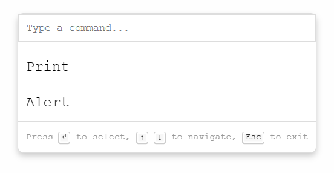

# Light Command Palette
[](https://github.com/julianmateu/light-cmd-palette/actions/workflows/test.yml/badge.svg)



## Description
Light Command Palette is a lightweight, customizable command palette built using vanilla JavaScript and CSS. It's designed for projects that require a simple yet powerful command interface without the overhead of additional dependencies.

## Features
- 🪶 **Lightweight**: No heavy frameworks or libraries.
- ⚙️ **Customizable**: Easily style and configure to fit your project.
- ✅ **Easy Integration**: Simple setup for any web project.

## Installation

### NPM

```bash
npm install light-cmd-palette
```

```js
import { initializeCommandPalette } from 'light-cmd-palette/src/commandPalette.js';
import 'light-cmd-palette/src/commandPalette.css'

initializeCommandPalette([
            { name: "Print", action: () => window.print() },
            { name: "Alert", action: () => alert("Executed Command 2") },
            // Add more commands here
        ])
```

### Static files
Light Command Palette can be included in your project by directly using the JavaScript and CSS files in the [`src`](./src) directory.

## Usage
To use Light Command Palette in your project, simply include the CSS and JS files in the [`src`](./src) directory in your HTML:

```html
<!DOCTYPE html>
<html lang="en">
<head>
    <!-- ... other head elements ... -->
    <link rel="stylesheet" href="path/to/commandPalette.css">
</head>
<body>

    <!-- ... your HTML content ... -->

    <script type="module">
        import { initializeCommandPalette } from 'path/to/commandPalette.js';
        const commands = [
            { name: "Command 1", action: () => { /* Command 1 action */ } },
            { name: "Command 2", action: () => { /* Command 2 action */ } }
            // ... other commands ...
        ];
        initializeCommandPalette(commands);
    </script>
</body>
</html>
```

Or import the file in your JavaScript file directly:
```js
import { initializeCommandPalette } from "path/to/commandPalette.js"

const commands = [
        { name: "Command 1", action: () => { /* Command 1 action */ } },
        { name: "Command 2", action: () => { /* Command 2 action */ } }
        // ... other commands ...
    ];

initializeCommandPalette(commands);
```

See [examples/index.html](./examples/index.html) for a complete example.

You can browse these examples with:
```bash
npx http-server examples
```

## Running Tests
Light Command Palette uses Playwright for end-to-end testing. To run tests:

### Install the dependencies:

```bash
npm install
```

### Run the linter:

```bash
npm run lint
```

### Run the tests:

```bash
npm run test
```
This command will execute the tests defined in the Playwright configuration.

## Contributing
Contributions to Light Command Palette are welcome! Please read our contributing guidelines for details on how to submit pull requests, report issues, or request features.

## License
MIT © Julian Mateu

